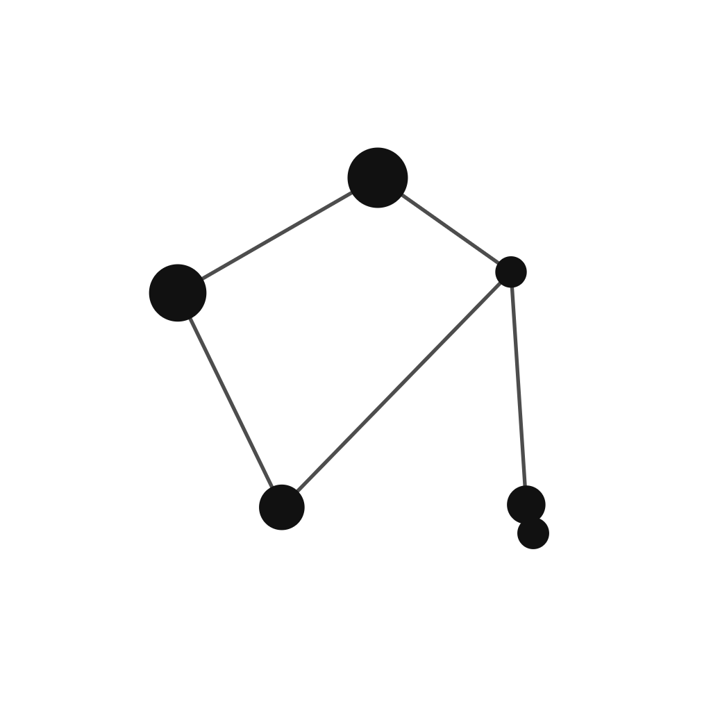

# ERROR404.NET brand guide

[Live guide](https://branding.error404.net) · [Email signature generator](https://branding.error404.net/#signature) · [Gravatar preview & downloads](https://branding.error404.net/#gravatar) · [Technitium block page](Technitium-Blocked/)

## Gravatar & profile images

| Multicolor | Night | Daylight |
| :---: | :---: | :---: |
|  |  |  |

Download a 1024 × 1024 avatar and the matching profile background from [gravatar/](gravatar/README.md), or use the guide's live square/circle preview and download controls. The files use the canonical Libra symbol with room for circular crops. Upload and assign your choice in Gravatar; the downloads do not update your account automatically.


## Technitium-Blocked

A branded, self-contained splash for Technitium DNS's **Block Page** app. It reads the blocked domain from the address bar and shows it with time, an optional category tag, and a pre-filled "request access" link. Grab `index.html` from [Technitium-Blocked/](Technitium-Blocked/), or customize it with the [live generator](https://branding.error404.net/#technitium). Setup notes: [Technitium-Blocked/README.txt](Technitium-Blocked/README.txt).

```
================================================================================

 ______ _____  _____   ____  _____  _  _    ___  _  _   _   _ ______ _______
|  ____|  __ \|  __ \ / __ \|  __ \| || |  / _ \| || | | \ | |  ____|__   __|
| |__  | |__) | |__) | |  | | |__) | || |_| | | | || |_|  \| | |__     | |
|  __| |  _  /|  _  /| |  | |  _  /|__   _| | | |__   _| . ` |  __|    | |
| |____| | \ \| | \ \| |__| | | \ \   | | | |_| |  | |_| |\  | |____   | |
|______|_|  \_\_|  \_\\____/|_|  \_\  |_|  \___/   |_(_)_| \_|______|  |_|

                     -=[ public brand guidelines ]=-
                          branding.error404.net

================================================================================

  RELEASE.....: Branding-Guide
  DATE........: 2026
  STATUS......: living document — colors locked, primary mark selected
  STACK.......: static HTML/CSS, GitHub Pages, zero build step
  TAGS........: brand / design-system / arcade / ascii / new-wave-hacker
  LICENSE.....: MIT — see LICENSE

--------------------------------------------------------------------------------
  SUMMARY
--------------------------------------------------------------------------------

  Public color, typography, and logo guidelines for ERROR404.NET. 90s
  warez-scene ASCII, arcade neon, and new-wave hacker — carried across the
  lab, the web presence, and anything printed. Rendered at:

    > https://branding.error404.net

--------------------------------------------------------------------------------
  DETAILS
--------------------------------------------------------------------------------

  > palette locked   : Arcade New Wave (bg/fg + blue/pink/yellow/mint)
  > primary mark     : Libra constellation node-graph mark — real RA/Dec
                        star positions, real magnitudes for node size, "404"
                        centered in the scales' quadrilateral. Full set: ring
                        / no-ring x black/white/blue/multicolor, a "4Ø4" ham
                        variant, and flat light-mode/dark-mode website icons.
  > wordmark lockup  : icon + "ERROR404.NET" wordmark, used wherever the full
                        domain name should read out loud
  > treatment modes  : Digital (full color/glow) vs. Print/Corporate (B&W,
                        ASCII-forward — Word/PDF/letterhead/email)
  > tagline (locked) : !ignore -> return "404: Message not found"
  > for AI agents    : see AGENTS.md — portable instructions for coding
                        agents/skills that should pull this guide as their
                        design source of truth

--------------------------------------------------------------------------------
  STRUCTURE
--------------------------------------------------------------------------------

    Branding-Guide/
      index.html          the whole guide, single static page, no build step
      assets/             logo renders + mockups referenced by index.html
      logos/              master logo set - SVG masters + full PNG export sizes
                           (ring/no-ring x black/white/multicolor, ham variant,
                           neon glow set, monogram-{night,daylight} icon pair,
                           watermark variant)
      entra-m365/         Microsoft Entra ID sign-in + M365 admin center branding
                           assets (square logo, banner logo, favicon, background,
                           accent color)
      office-templates/   Word templates (Corporate B&W + Digital Color, letterhead,
                           envelope, cover page, report), Office Theme (.thmx),
                           PowerPoint template
      email-templates/    HTML newsletter/transactional/report-notification email
                           templates, M365/Outlook signature (standard + minimal):
                           signature.js is the single source, used by the site's
                           copy-to-Outlook generator (#signature) and by
                           build-signatures.js to regenerate the static .html files.
                           hosted-images/ is served from GitHub Pages at
                           branding.error404.net/email-templates/hosted-images/
      social/             linkedin/, youtube/, stickers/, avatars/ - per-platform
                           banner/icon/watermark assets
      Technitium-Blocked/ self-contained Technitium DNS "Block Page" splash (index.html),
                           template, build.py, setup notes; generator at #technitium
      discord/            server icon/banner/splash + BetterDiscord/Vencord
                           client theme (.theme.css)
      obs/                OBS Studio scene collection + theme assets
      Hugo-template/      reusable Error404 Hugo layout (dark/nfo/light modes) —
                           copy layouts/ and static/ into any Hugo site
      AGENTS.md           portable brand instructions for AI coding agents/skills
      CNAME               GitHub Pages custom-domain file (branding.error404.net)
      LICENSE             MIT

    Every downloadable file uses placeholder tokens (<Your Name>, <phone>, etc.)
    rather than real contact details - fill those in per document before use.
    Each top-level folder has its own README.txt with size/usage specifics.

--------------------------------------------------------------------------------
  PUBLISHING (GitHub Pages)
--------------------------------------------------------------------------------

  > repo Settings -> Pages -> source: `main` branch, `/` (root)
  > DNS: CNAME record for the `branding` subdomain -> <username>.github.io
  > this repo's CNAME file already tells Pages to expect branding.error404.net

  Everything is static — edit index.html, swap files in assets/, commit, push.

--------------------------------------------------------------------------------
  LINKS / REFS
--------------------------------------------------------------------------------

  > live guide  : https://branding.error404.net
  > tagline origin: a prompt-injection joke dressed as a function return —
                    started as an email-signature easter egg, but the wink
                    is now kept off real outbound mail (a recipient's AI
                    mail-security scanner could read it as a live injection
                    attempt). Locked and used everywhere else: site,
                    marketing, PDF.

================================================================================
                    ERROR404.NET  //  73 de operator  //  2026
================================================================================
```
